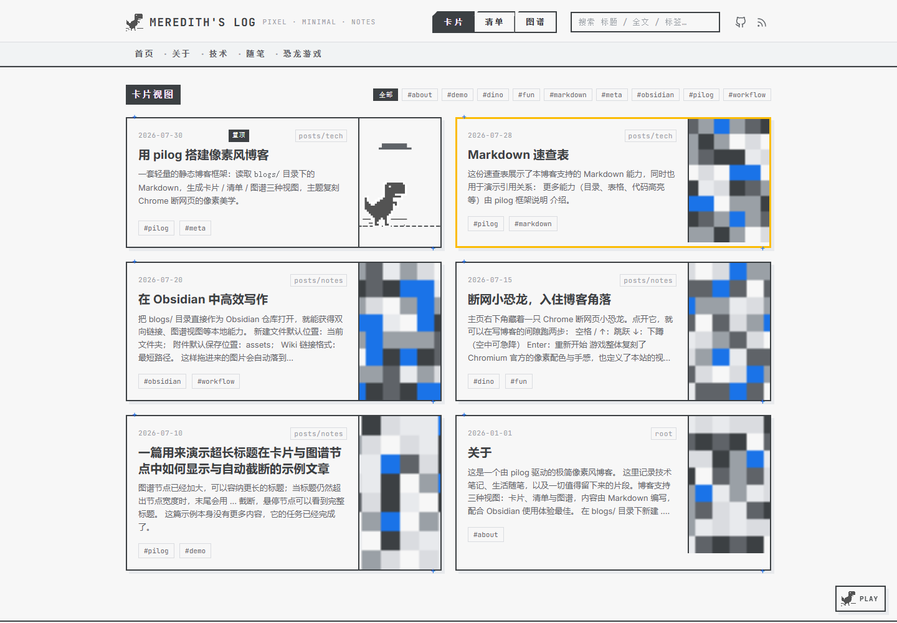

# pilog — 像素风静态博客框架

轻量、美观、面向 Obsidian 工作流的静态博客生成器。读取 `blogs/` 目录下的 Markdown，生成带**卡片 / 清单 / 图谱**三种视图的静态站点；主题复刻 Chrome 断网页小恐龙的像素美学（灰白底、锐利直角、无多余圆角）。

> 想快速上手（或让 Agent 帮你操作）？直接读本文档即可；API 与配置项清单见博客里的 [pilog-blog](blogs/posts/toy/pilog-blog.md)。



## 特性

- **三种视图**：卡片（含手动/自动预览与预览图）、清单（Windows 式文件树）、图谱（力导向关系图，目录层级为实线箭头、文章引用为蓝色虚线箭头）；
- **图谱细节**：节点加大、长标题末尾以 `...` 自适应截断（悬停显示完整标题）；代表站点的根节点为白底描边 + 像素小恐龙，不再是一块黑色方块；
- **贪吃蛇彩蛋**：图谱外沿有一条像素贪吃蛇，沿节点云的外包络线无限巡逻，始终与节点/连线保持安全间距；节点被拖到它附近时它会“逃跑”，工具栏有开关可随时显隐；
- **回到首页默认卡片视图**：从任何页面返回首页都显示卡片视图；只有带 `#view-tree` / `#view-graph` 的显式深链接（如导航里的目录项）才会直接打开对应视图；
- **卡片分页**：超过 `cards_per_page`（默认 12）自动生成 `page/2.html`… 静态分页页，带页码导航；
- **默认折叠**：文章超过 `collapse_threshold`（默认 25）后，清单视图与图谱视图会默认折叠文章较多（≥4 篇）的叶子目录，单击目录节点或文件夹即可按需展开；
- **搜索**：页头搜索框支持标题 / 全文 / 标签检索（`/` 快捷键聚焦），输入即出下拉结果；
- **置顶与高亮**：front matter 里 `pin: true` 的文章在卡片视图置顶显示（带「置顶」徽章）；`highlight: true` 的文章在卡片、清单、图谱三种视图中都带黄色描边；
- **Markdown 高度支持**：表格、脚注、任务列表、目录锚点、服务端 Pygments 代码高亮（几乎所有语言）、等宽代码字体；
- **Obsidian 语法**：`![[图片.png]]`、`[[文章]]`、`![[图片.png|300]]` 均原生支持，也支持 Markdown 原生相对/绝对路径图片；
- **图片工作台**：本地拖入图片即导入，支持缩放、裁剪、旋转、替换、删除，并一键复制引用片段；
- **所见即所得工作台**：本地 `/manager` 提供配置表单 + 博客首页实时预览编辑——直接点选/拖拽更换头图与背景长图、增删改导航栏、拖拽卡片排序（跨入置顶区即置顶）、双击卡片编辑标题/预览/标签/高亮/全文、拖图到卡片设置预览图；所有修改即时写入本地文件，支持撤销/重做，并实时显示每次修改影响的文件；
- **手机写作**：`tools/write.html` 是单文件、可离线的 Android 写作页（线上位于 <https://meredith2328.github.io/write/>，serve 时位于 `/write`，局域网手机也能打开；文章页的「✎ 编辑」可从 `pilog` 载入原文原地修改）：编辑 / 预览 / front matter 表单、本机多稿件自动保存、导出 `.md`；仓库主人还可以用**只存在自己手机上**的 fine-grained token 直接「发布（开 PR）」到 `pilog`（见[手机发布](#手机发布开-pr)）；
- **导航自定义**：`blogs/nav.md` 决定导航栏内容（支持多级下拉）；
- **giscus 评论 + RSS**：`config.json` 填好仓库即可开启评论，`rss.xml` 自动生成；
- **社交图标**：GitHub / X / Bilibili / 微博 / 邮箱，配置后显示在页头；
- **小恐龙彩蛋**：复刻版 Chrome 断网小恐龙游戏固定在页面右下角，配色即本站主题；
- **GitHub Pages 就绪**：所有内部链接按页面相对路径计算，部署在 `meredith2328.github.io/blogtest` 这类子目录下也不会迷路。

## 目录结构

```
pilog/
├── blogs/                 # 博客源目录（可直接作为 Obsidian 仓库打开）
│   ├── nav.md             # 导航栏（一个 Markdown 文件）
│   ├── about.md           # 示例文章（根级文章）
│   ├── assets/            # 全局图片（![[xx.png]] 会在这里查找）
│   └── posts/             # 文章按目录归类，目录即层级
│       ├── tech/          #   └─ 技术主题
│       └── notes/         #   └─ 随笔主题
├── config.json            # 站点配置
├── build.py               # 构建脚本
├── serve.py               # 本地开发服务器 + 图片工作台
├── pilog.py               # 命令行入口（与工作台同一套代码）
├── publish.py             # 一键发布到 GitHub
├── requirements.txt       # Python 依赖
├── generator/             # 生成器源码（模板/样式/脚本）
├── tests/                 # 自动化测试（图/路径/工作台/线上）
├── tools/                 # 本地辅助工具（工作台页面/素材生成/截图）
├── dino/                  # 小恐龙游戏（构建时复制进站点）
├── docs/                  # 生成的静态站点（部署产物）
└── .github/workflows/     # GitHub Actions 部署
```

## 快速开始

需要 Python 3.10+，建议使用 venv/conda 建立自己的环境：

```bash
python -m pip install -r requirements.txt   # 安装依赖

python pilog.py build                        # 构建静态站点
python pilog.py serve --watch                # 本地预览 + 自动重建
# 打开 http://127.0.0.1:8000/ ，工作台在 /manager
```

常用命令行：`pilog.py list`（列出文章）、`pilog.py import 目录`（批量导入旧笔记）、`pilog.py delete <rel>`（删除文章）、`pilog.py publish -m "说明"`（构建并推送）。

## 写作工作流（Obsidian）

1. 用 Obsidian 打开 `blogs/` 目录作为仓库；
2. 新建 `.md` 文件，例如 `blogs/posts/tech/我的文章.md`；
3. 可选 front matter：

   ```yaml
   ---
   title: 我的文章
   date: 2026-08-01
   tags: [tech, 随笔]
   preview: 手动指定的预览内容，支持 Markdown。
   preview_image: assets/封面.png
   draft: false
   ---
   ```

   - 不写 `title` 时取正文第一个标题；不写 `date` 时取文件修改时间；
   - 不写 `preview` 时自动截取正文（自动跳过标题、代码块、表格、脚注，只保留有信息量的段落）；
   - `preview_image` 不填时使用正文第一张图片，都没有则生成一张随机的像素占位图；
   - 不写 `tags` 时，卡片会以目录路径（如 `posts/tech`）作为层级标签展示。
4. 图片引用三种写法都可以：

   ```markdown
   
   ![[Obsidian 全局引用.png]]
   ![[指定宽度.png|300]]
   ```

5. 文章互相引用（会在图谱中生成虚线箭头）：

   ```markdown
   [Markdown 速查表](markdown-cheatsheet.md)
   [[另一篇文章]]
   [[另一篇文章#章节]]
   ```

6. 运行 `python pilog.py build`（或开着 `python pilog.py serve --watch` 自动重建），检查效果后提交。

   另外几个可选 front matter 字段：`pin: true` 让文章在卡片视图置顶；`highlight: true` 给文章加黄色描边（三种视图都显示）；`chapters_per_page: N` 让超长文章按标题切分成章节、在同一链接下分页显示（每页 N 章）。

## 手机发布（开 PR）

写作页随站点一起部署：构建时 `build.py` 把 `tools/write.html` 原样复制到 `docs/write/index.html`（和 `docs/tools/write.html`），所以合并部署后在 **<https://meredith2328.github.io/write/>** 就能打开，博客导航栏也有「写作」入口。页面不进 sitemap，带 `noindex`。

写作页「导出 → 发布（开 PR）」会在浏览器里直接调用 GitHub API：从最新的 `pilog` 新建 `write/<日期>-<文件名>` 分支 → 把拼好 front matter 的 Markdown 写到表单显示的 `blogs/posts/…/*.md` → 开 PR 到 `pilog`，并显示 PR 链接（可复制 / 打开）。**永远不直接推送 `pilog`，也不自动合并**；在 GitHub 上审阅后手动合并，合并即触发自动部署。同一篇稿件再次发布时，会询问「更新这个分支」（追加提交，已开的 PR 自动带上改动）还是「新开一个分支」；`pilog` 上已有同名文件时会先确认是否作为「修改已有文章」提交。

**仓库主人一次性设置**（令牌只存在这台手机上）：

1. GitHub → Settings → Developer settings → Fine-grained tokens → [Generate new token](https://github.com/settings/personal-access-tokens/new)；
2. Resource owner 选 `Meredith2328`，Repository access 选 **Only select repositories** → `Meredith2328/pilog`；
3. Repository permissions 只开 **Contents: Read and write** 与 **Pull requests: Read and write**（Metadata: Read 自动带上），其余保持 No access；设置到期时间；
4. 手机打开写作页 →「稿件 → GitHub 令牌」（或导出面板里的「令牌」）粘贴并「保存并验证」。默认只存 `sessionStorage`（关闭标签页即清除）；打开「在这台设备上记住」才存 `localStorage`。随时可「清除令牌」，丢手机时到 GitHub 上 Revoke 即时失效。

**原地修改已发布的文章**：

- 每篇文章页的元信息行有「✎ 编辑」，链接到 `/write/index.html?path=blogs/posts/…/*.md`；也可以在写作页「稿件 → 编辑线上文章」输入路径或直接粘贴文章网址（`posts/…/x.html` 会换成对应的 `.md`）。只接受 `blogs/posts/` 下的 `.md`；
- 有令牌时用 Contents API 读取 `pilog` 分支上的当前版本（`GET /repos/Meredith2328/pilog/contents/<path>?ref=pilog`）放进本机稿件；没有令牌会先请你设置，保存后自动继续载入；
- 没改信息字段时原样保留原文的 front matter 与空白，PR 的 diff 只有你改动的正文；
- 发布走同样的流程：新建 `write/<载入日期>-edit-<文件名>` 分支，带着载入时的文件 sha 提交修改，开「更新文章：…」PR 到 `pilog`。如果载入后 `pilog` 上这篇又被改过（比如别的 PR 已合并），发布前会提示，可以选「载入线上最新」或确认用自己的版本；
- 再次打开同一篇时：线上没变就继续本机稿件；本机和线上都改过时会询问，「载入线上最新」会另存一份，不会覆盖本机改动。

**合并是唯一的发布闸门**：写作页只会建 `write/*` 分支和开 PR，不会调用 merge 接口、不会开启自动合并、不会写 `pilog`。Daniel 在 GitHub 上审阅 diff 后手动合并，合并到 `pilog` 才会触发 `deploy.yml` 更新线上站点；不合并的 PR 关掉即可，线上不受影响。

**安全边界**：

- 页面没有后端，也没有任何共享的 GitHub App、OAuth 密钥、PAT 或 Actions secret 可供它使用；令牌不会写进 HTML/JS、稿件或导出文件，只随请求直接发往 `api.github.com`（页面的 CSP 把 `connect-src` 限定为本站与 `api.github.com`，请求一律 `credentials: "omit"`、`no-referrer`）；
- **访客无法发布**：没有令牌时「发布」按钮锁定，但写作、预览、导出照常可用。发布只能用对 `Meredith2328/pilog` 有写权限的账号的令牌；陌生人的令牌会被 GitHub 拒绝（401/403/404，或仓库返回无 push 权限），页面随即锁定发布；
- 页面不会 fork 仓库、不邀请协作者、不修改任何仓库设置或分支保护，也不会给陌生人开放写权限；
- 令牌无效、权限不足、仓库未授权、速率限制、离线等情况都会给出中文提示，稿件始终保留在本机；
- 令牌存在浏览器里，与同源页面共享存储：请只在自己的设备上保存，不要在共用浏览器里勾选「记住」；
- 线上写作页与博客同在 `meredith2328.github.io` 源下，而博客页面会加载 Google Analytics、giscus 等第三方脚本，这些脚本理论上能读到同源的 `localStorage`。所以默认只存 `sessionStorage`；若勾选「记住」，请给令牌设较短的到期时间，并保持只授权 `Meredith2328/pilog` 的两项权限。注意 Contents 写权限本身允许通过 API 直接写任何分支：写作页从不这样做，但令牌一旦泄露，别人可以。想让「只能走 PR」成为硬约束，可以给 `pilog` 开分支保护（Settings → Branches / Rulesets：Require a pull request before merging）；
- 这个流程不需要、也不使用任何 Actions secret；`deploy.yml` 的 `PILOG_TOKEN` 只用于部署，与写作页无关。

## 文件管理（manager 的“文件管理”页）

支持图片与 Markdown 的统一管理：

- **图片**：拖入导入，点选后进入编辑器——裁剪、缩放、旋转、替换、删除，另有 **✎ 文字**（双击/点击画布放置文字，可设大小、字体、颜色）与 **🖌 画笔** 工具，批注会随导出合成；
- **Markdown 导入**：把 `.md` 文件、多选文件或**整个文件夹**（含多层嵌套）拖入即可，自动保留目录结构写入 `blogs/`；导入前会弹出分析面板，列出缺失的图片引用与引用了其他 Markdown 的链接，由你决定“保留链接 / 转为纯文本 / 移除缺失图片引用”；
- 底部片段框可复制 Obsidian 引用与 Markdown 相对路径。

## 本地工作台（仅本机可访问）

`python pilog.py serve` 后访问 `http://127.0.0.1:8000/manager`。工作台是**本地开发工具**：服务器默认只监听 `127.0.0.1`，且 `/manager` 与 `/api` 会拒绝一切非本机来源的请求，构建产物 `docs/` 中也不会包含它。

- **预览编辑**：所见即所得地修改博客首页——点左上角头图或顶部背景图即可上传替换（`blogs/assets/logo.png`、`blogs/assets/header.png`），悬停导航项可编辑/删除/加子项/加新项（写入 `blogs/nav.md`），拖动卡片排序（写入文章 front matter 的 `pin` / `order`），双击卡片编辑元数据与全文（写入对应 `.md`），把图片拖到卡片右侧可设为该文预览图；预览顶部可在**卡片视图 / 清单视图 / 图谱视图**间切换，图谱视图会自动重新构建后嵌入真实图谱；把 Markdown 或文件夹拖到卡片区（松开前有占位框）或清单目录上即可导入并自动排入对应位置；
- **配置**：站点标题、路径、社交账号、giscus、分页与折叠阈值等（写入 `config.json`）；
- **恢复默认**：配置页提供「恢复默认」（把 `config.json` 重置为框架默认值）与「恢复默认头图 / 恢复默认背景」（删除自定义 `logo.png` / `header.png`，回到内置小恐龙与像素横幅），均可撤销；
- **撤销 / 重做**：顶部按钮或 `Ctrl+Z` / `Ctrl+Y`，服务端对每个操作保存受影响文件的快照；`Ctrl+S` 保存当前编辑（文章弹窗/导入确认/配置/重新构建）；
- **删除确认**：导航项、子项、头图、背景图、图片等删除前都会二次确认；
- **内置 SVG 像素素材**：无自定义背景时顶部显示极简像素横幅（远山 + 小太阳），清单视图使用像素文件夹/文件图标，搜索无结果与 404 页有小像素插图——全部为主题灰白配色，克制不抢眼；
- **变更记录**：右侧抽屉实时列出每次修改影响的具体本地文件；
- **重新构建**：改完后点“重新构建”（或开着 `--watch` 自动构建），再到“打开博客”查看最终效果。

## 导航栏（nav.md）

`blogs/nav.md` 是一个普通 Markdown 文件，构建时解析其中的链接列表作为导航栏，支持嵌套子菜单：

```markdown
# 导航

- [首页](/)
- [关于](about.md)
- [技术](posts/tech/)
  - [Markdown 速查表](posts/tech/markdown-cheatsheet.md)
- [恐龙游戏](dino/)
```

导航中的 `首页`（`/`）会解析为**页面相对链接**，在任何部署路径（包括本地预览、`/blogtest` 子目录）下都能正确回到主页；其他 `/` 开头的绝对链接会自动带上 `config.json` 里的 `base_path`。目录链接若没有 `index.md`，会跳到主页的「清单视图」对应位置。

## 配置（config.json）

```jsonc
{
  "site": {
    "title": "MEREDITH'S LOG",        // 站点名
    "subtitle": "pixel · minimal · notes",
    "author": "Meredith",
    "base_path": "/blogtest",         // 部署在子目录时填，如 meredith2328.github.io/blogtest
    "site_url": "https://meredith2328.github.io/blogtest", // 绝对地址，RSS/OG 用
    "google_analytics_id": "G-XXXXXXXXXX", // GA4 衡量 ID；留空则不加载
    "use_google_fonts": true,         // 网络受限时改为 false，使用系统字体
    "show_dino": true,                // 右下角小恐龙
    "cards_per_page": 12,             // 卡片视图每页数量
    "collapse_threshold": 25          // 超过该文章数时，清单/图谱默认折叠大目录
  },
  "giscus": {                         // 评论（GitHub Discussions）
    "enabled": true,
    "repo": "meredith2328/blogtest",
    "repo_id": "...",                 // 在 https://giscus.app 获取
    "category": "Announcements",
    "category_id": "..."
  },
  "socials": {
    "github": "https://github.com/meredith2328",
    "x": "", "bilibili": "", "weibo": "", "email": "",
    "rss": true
  }
}
```

## 构建与部署（GitHub Pages）

1. 修改 `config.json` 中的 `base_path` 与 `site_url`；
2. `python pilog.py build` 生成 `docs/`；
3. 提交源码改动与生成的 `docs/`，并推送 `pilog` 分支；
4. 仓库自带的 `.github/workflows/deploy.yml` 会构建、测试，并将 `docs/` 同步至部署仓库；
5. 打开配置的 `site_url` 验证。

### 一键发布（框架内置）

框架内置了手动发布兜底：构建站点 → `git add/commit` → 推送指定部署仓库。日常发布优先直接推送源码仓库的 `pilog` 分支，由 GitHub Actions 自动完成部署。

```powershell
python pilog.py publish                 # 构建 + 提交 + 推送
python pilog.py publish -m "发布说明"    # 自定义提交信息
```

或在工作台的「配置 → 发布到 GitHub」面板填写仓库、分支与令牌后点「发布到 GitHub」。令牌只写入本地 gitignore 的 `.publish-token-pages`（或环境变量 `PILOG_TOKEN`），不会进入仓库；发布流程只有 add/commit/push，不包含任何删除性操作。

**Fine-grained PAT 的最小权限**（GitHub 只能在网页端创建，无法通过 API 生成）：

1. GitHub → Settings → Developer settings → Fine-grained personal access tokens → Generate new token；
2. Repository access 选 **Only select repositories** 并勾选你的博客仓库；
3. Repository permissions 里只需开启：
   - **Contents: Read and write**（推送代码与站点）；
   - **Metadata: Read**（强制项，会自动带上）。

不需要 Actions、Workflows、Administration、Pages 等权限——推送后仓库自带的 GitHub Actions 会用它自己的 `GITHUB_TOKEN` 完成 Pages 部署；fine-grained token 本身也无法删除仓库。

### 自动部署（GitHub Actions）

`push` 到 `pilog` 分支时会自动触发 `.github/workflows/deploy.yml`：在 CI 里安装依赖、`python build.py` 构建、跑 `tests/test_features.py`，然后把 `docs/` 提交并推送到部署仓库（`config.json` 的 `publish.repo` / `publish.branch`），GitHub Pages 随即更新。**推代码即上线，无需本地跑 publish。**

只需要一次性配置：

1. 在 GitHub → Settings → Developer settings 创建 **fine-grained PAT**，Repository access 勾选**部署仓库**（如 `meredith2328.github.io`），权限开 **Contents: Read and write**（+自动带上的 Metadata: Read）；
2. 把令牌加到**源码仓库**的 Settings → Secrets and variables → Actions，命名为 `PILOG_TOKEN`（与 `publish.py` 读取的环境变量同名）。

未配置 `PILOG_TOKEN` 时工作流会失败并在日志里提示原因，不会误推。本地 `publish.py` 不受影响，仍可在无 CI 或需要手动发布时使用。

### giscus 评论

giscus 是**客户端**评论系统（GitHub Discussions 驱动），博客侧不需要任何令牌。需要两步仓库级设置：

1. 仓库 Settings → 勾选 **Discussions**（已为 `Meredith2328/pilog` 开启）；
2. 安装 **giscus GitHub App** 到该仓库：访问 https://giscus.app → 配置后点安装（或直接 https://github.com/apps/giscus/installations/new）。这一步必须在网页端由仓库所有者确认，无法用 API 代替。

`config.json` 的 `giscus` 段已填入本仓库的 `repo_id` / `category_id`，安装应用后评论即可正常工作（可用 `python tests/test_live.py` 验证部件挂载）。

### 关于相对路径的坑（重要）

如果你的博客部署在 `meredith2328.github.io/blogtest` 子目录，最常见的错误是「从子页面点回首页跳到了 `meredith2328.github.io` 根目录」。pilog 的解法：

- **所有内部链接都在构建时按页面计算为相对路径**（如文章页里的 `../../index.html`），与部署位置无关，天然支持子目录；
- 你写的 `/assets/xx.png` 这类根路径链接，会被自动加上 `base_path` 前缀（如 `/blogtest/assets/xx.png`）；
- `site_url` 请务必填写**完整地址（含子目录）**，RSS 与分享卡片才不会出错。

## 常见问题

**文章很多（100+）会卡吗？** 实测 100 篇文章规模：构建约 1.4s、首页 204KB、卡片视图首屏约 1s、清单视图展开全部约 50ms、图谱布局+预热约 150ms、贪吃蛇运行时保持 60fps。图谱在 100 篇量级节点会超出首屏可视区（文字保持可读，可滚轮缩放/平移或用目录折叠），属于预期行为。

**`![[图片]]` 找不到？** 图片按以下顺序查找：文章同目录 → `blogs/` 根目录 → `blogs/assets/` → 任意名为 `assets` 的目录。建议统一放在 `blogs/assets/`。

**`[[文章]]` 链接解析规则？** 同目录下同名的文章优先；全仓库唯一时直接匹配；重名时请写成 `目录/文章` 形式。

**想换字体或配色？** 主题样式集中在 `generator/static/css/style.css` 顶部的 CSS 变量里（`--paper`、`--ink`、`--accent` 等）。

**字体从哪来？** 字体已自托管在仓库里（`generator/static/fonts/`，Inter + JetBrains Mono 的 woff2），`config.json` 里 `use_google_fonts: false` 可关闭、回退到系统字体（Windows 上为 Segoe UI + 微软雅黑，代码为 Cascadia Code/Consolas）。KaTeX 也已自托管（`generator/static/vendor/katex/`），全站不依赖 Google Fonts 与 jsDelivr CDN。

## 许可

代码与主题为 MIT 许可（见 [LICENSE](LICENSE)）。小恐龙精灵图与音效来自 Chromium 项目（BSD-3-Clause），游戏逻辑参考 [wayou/t-rex-runner](https://github.com/wayou/t-rex-runner)（MIT），详见 `dino/README.md`。
