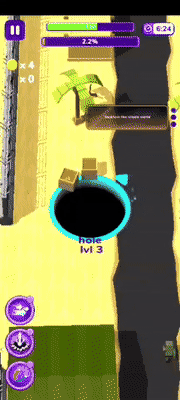
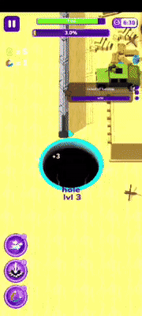
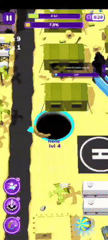
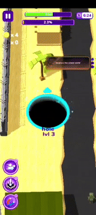

**Jev 这种自称是为程序而生的、快速决策的 System One 模型，游玩实际的手机游戏体验如何？**

我选了 Android 上的 HOLEIN （黑洞大作战）。目标很朴素：黑洞移动、吞小物体、逐渐长大，直到能吞掉整张地图。

<!-- more -->

## 概述

> 如何让Agent获取到手机画面，把有限而真实的游戏状态交给 Jev 做方向选择，再由Agent执行动作并验证结果？

Jev **不看图片**（**所以对游戏环境的建模需要你自己来做**！）、不操作手机，也不拥有循环。它是模型，而不是Agent Loop本身。它负责在代码给出的有限选项中，返回带概率和置信度的结构化判断。

因此，除了Jev之外的一切代码系统都是我们自己写的。Jev只是一个决策的模型而已。

```text
Android 屏幕状态（安卓手机真机）
    │ ADB 截图（只留在本机）
    ▼
本地感知：洞口、候选物、尺寸、方位、近期变化
    │ 结构化精简 JSON（不上传截图）
    ▼
Jev 选择下一步方向
    │ typed answer + probabilities + confidence
    ▼
代码通过 ADB 在屏幕上操作
    │
    └──────── 回到开头 (下一帧) ────────┘
```

初版验证用 Playground 做了一次最小试验：

我把“洞在中央、左上有小木箱、右侧是大建筑”写成状态，给出~~上北下南左西右东~~八个方向和 `hold`。Jev 返回 `up_left`，概率和置信度都很高。接着用 ADB 执行移动，并回读屏幕，完成一次最小闭环。

## 建立游戏闭环

根据 [TypeSafe 的构建指南](https://docs.typesafe.ai/concepts/how-to-build-with-system-one)，控制流、确定性规则和副作用应该留在代码里。于是后续改成直接调用 API：

```python
response = client.system_one(
    state=compact_game_state,
    questions={"next_move": Choice(...)},
)

direction = response.choices["next_move"].choice
adb_swipe(direction)
```

在我实测的过程中，Jev 的单次 API 延迟大约在 **0.27–0.95** 秒之间。

就我们要建立起的游戏闭环而言，速度瓶颈不在模型，而是在我的安卓手机上进行高分辨率手机截图的 PNG 压缩：1220×2712 一帧约 **2.19** 秒。把 Android 的逻辑分辨率临时降到 305×678 后，截图约 455 毫秒，本地像素处理约 26 毫秒，游戏才开始有接近连续控制的感觉。

下面是一段实际演示的gif动图，用来证明“截图 → 状态 → Jev → ADB swipe”确实在真实游戏中持续运行。



下述是我录制到的从 Level 3 到 Level 4 的升级。



## 数据格式参考

Jev 当前不接收图像，所以屏幕截图没有离开电脑。上传的是像下面这样的状态：

```json
{
  "player": {
    "hole_radius_px": 60,
    "hole_diameter_px": 120,
    "level_estimate": 3
  },
  "candidates": [
    {
      "direction": "up_right",
      "distance_px": 92,
      "width_px": 37,
      "height_px": 18,
      "span_to_hole_diameter": 0.31,
      "area_to_hole_opening": 0.09,
      "aspect_ratio": 2.06,
      "visual_shape": "compact object"
    }
  ],
  "recent_actions": ["left", "up_left", "right"],
  "stagnant_steps_without_detected_growth": 6
}
```

控制器会记录每次请求的语义 payload 字节数、token 用量、延迟、置信度和实际执行方向，并在请求过大时停止。早期状态每次大约 1.3 KiB；加入物体相对尺寸、最近动作和停滞信息后约为 3–4 KiB。

考虑到我们并不能直接把图片喂给模型进行决策，我们的游戏过程很大程度上取决于环境状态获取得够不够好，需要把真正影响动作的状态关系说清楚。

但在状态建立得还不错的情况下，Jev确实能够进行游戏决策，决策得还挺快。

## Jev 在状态给得不那么明确的前提下，仍然有可能玩出死循环

最初的本地感知中，我们的状态给得比较粗糙。

它只会找深色、紧凑的连通区域。它能找出一些小物体，却不理解“这是一栋房子”“它比洞大”“这几步只是围着同一块结构打转”。于是自然而然出现了死循环：模型有时会在两个相近方向间往返，或者把建筑碎片当成候选目标。

录屏后段能看到这个问题的真实场景：洞已到 Level 4，地图上出现大型建筑、停机坪与成片结构。画面不是模型的输入；本地感知只能把它们压缩为几何描述，因此“建筑”在状态里如果只剩一块深色连通域，就会丢失最关键的可吞性关系。



这里最重要的一次修正并不是再写一个更聪明的本地贪心策略。那样只是用规则把 Jev 架空。

更合理的修正是补齐状态：

- 物体相对洞口的跨度、面积和宽高比；
- 组件的紧凑度、颜色与“像独立物体还是长条/大型结构”的视觉描述；
- 洞口尺寸最近是否真的增长；
- 最近动作序列和各方向的重复次数；
- 卡住时的随机探索建议。

我本来想直接把随机性直接强制写进我们采用的策略中。但是转念一想：为什么不把要不要执行随机方向也作为Jev的一个选项呢？当最近动作已经形成循环、洞口却没有增长时，Jev 可以把它作为打破平局的方向；是否执行仍由返回的 Choice 决定。

**这个模型确实能玩一些游戏，但前提是状态已经把它需要判断的关系表达出来。**

## What's more?

上述只是使用 Jev 游玩 HOLEIN 游戏的简单尝试，做得很粗糙，还不是一个可靠的自动通关器。

本地像素处理写得比较简单，只能描述几何关系，不能真正识别 HOLEIN 里的每种建筑、道具或敌人。洞口半径也可能被特效、遮挡和 UI 文字影响。模型的概率和置信度能告诉我们它在给定状态下是否犹豫，却不能弥补缺失的视觉证据。

如果要把这个实验继续做成稳定系统，可以在更可靠的本地感知层着手：能分割物体、追踪同一目标、确认“吞掉了什么”，再把这些事实交给 Jev。不要把提示词搞得太长，也不要把策略喂给它。

下面这段 GIF 覆盖了一段实际游玩的 175 秒录屏，并以 5× 速度播放（只降采样取了部分帧，所以看起来没有特别流畅），供参考。



“让 AI 玩游戏”并不是一个已经解决的问题。我们只是做了一次有用的拆解：控制系统能跑、模型能决策、手机真的会动；但视觉状态太粗糙时，循环同样会真实地卡住。
