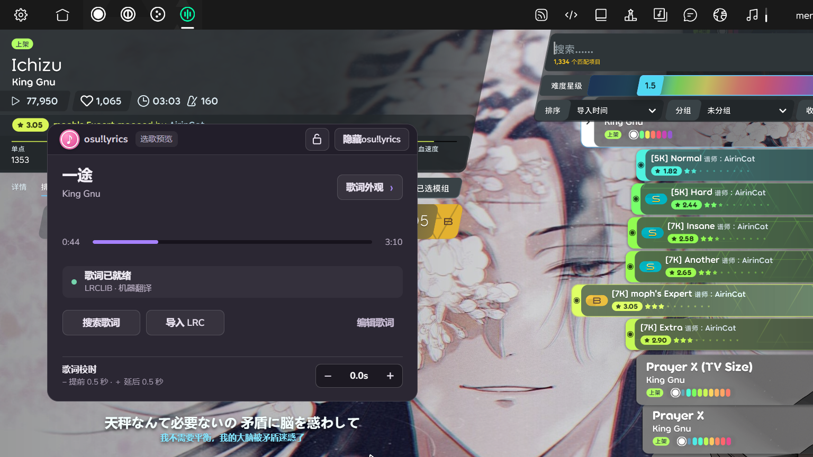

打 osu!lazer 时，我想把日文原词和中文翻译放在屏幕边上，选歌预览时也能看见。真正费工夫的不是画一个透明窗口，而是回答三个问题：现在放的是哪一首、歌词文件是不是这首歌的这个版本、这一帧该显示哪一句。

[osu!lyrics 的 Windows 版和源码](https://github.com/Meredith2328/osulyrics)已经放在 GitHub。它是游戏外的独立窗口，下面这张图是在 osu!lazer 选歌界面实际运行时截的；小窗可以收起，歌词留在原位。

<!-- more -->

## 先取得游戏的时间，而不是猜时间

我没有去改 osu! 的源码，也没有从窗口标题猜歌名。程序第一次运行时可以单独安装 [tosu](https://github.com/tosuapp/tosu)；它在本机提供状态接口，osu!lyrics 每隔约 100 毫秒读取 `127.0.0.1:24050/json/v2`。[`normalizeTosu`](https://github.com/Meredith2328/osulyrics/blob/main/src/osu.cjs)把返回值收成一份固定的数据：谱面的 Unicode/罗马字曲名、歌手、难度名、当前谱面时间 `beatmap.time.live`、音频长度 `mp3Length`、暂停状态，以及打图时 Mod 的播放倍率。tosu 负责观察游戏，我的窗口只负责歌词。这条边界也让工具不用随 osu! 的内部结构一起编译。

只在前端拿到一次时间后靠 `Date.now()` 一直往前推，短时间看不出问题，暂停、重试、切歌后却会漂。现在的规则是：**以 tosu 的最近一次谱面时间为准，只在两次采样之间补一点画面时间**。[`advancePosition`](https://github.com/Meredith2328/osulyrics/blob/main/src/playback-clock.js)最多补 180 毫秒，并乘当前播放倍率；一旦暂停或断开就停在采样值，不再自走。重新采样会直接校正位置，所以重试也不会继承上一轮的计时。

歌曲结束还有一条独立边界。打图最后一个物件不等于音频结束，而短版歌曲的 LRC 可能来自更长的录音。程序优先用 `mp3Length` 判断音频终点，到达后停止显示；进入结算画面也会清掉歌词。选歌预览则继续使用 tosu 报告的 `live` 时间，第一句还没到时不提前亮出后面的词。LRC 自身的固定偏差留给每首歌的校时值处理，避免把“文件偏了 0.5 秒”和“播放时钟漂了”混在一起。

## 歌名相同，不代表歌词就是同一份

带时间戳的歌词从 [LRCLIB](https://lrclib.net/docs) 取。先查本地 LRC，再查在线候选；本地导入或编辑过的文本优先。搜索词会试 Unicode 曲名和罗马字曲名，也会去掉 `TV Size` 等版本后缀，但**去掉后缀只是为了找到候选，不是直接认定候选可用**。真正选择时还要看音频长度。这样 `Gurenge (TV Size)` 能找到名字略有差异的歌词，同时不会把完整录音的时间轴套在短版上。

[`rankLyrics`](https://github.com/Meredith2328/osulyrics/blob/main/src/lyrics.cjs)给曲名、歌手、时长和歌词语言分别计分。曲名完全相同加 70 分，歌手完全相同加 40 分；时长差在 12 秒内加 25 分，差到 45 秒以上则扣 100 分。自动选用还要求至少 75 分；若前两名分数接近、时长却差了 15 秒以上，就交给用户挑。这个保守规则比“搜索第一条就是答案”更符合打图场景。

语言也不能只看曲名。`Love Letter - YOASOBI` 有英语和日语歌词候选，曲名与歌手可以完全一样。程序检查 LRC 正文的假名分布；谱面没有明确写 English Version、且候选同时有英日两种时，优先日文。过去自动缓存过的英文候选也会重新复核，但用户手动选定的版本不会被覆盖。

合集谱面更麻烦：`Various Artists - 6k Starter Pack` 的实际歌名可能写在难度里。[`parseCompilationDifficulty`](https://github.com/Meredith2328/osulyrics/blob/main/src/osu.cjs)只对符合“合集作者 + 曲包标题”的谱面尝试从难度名拆出歌手和歌名；普通谱面的 `Hard`、`Expert` 不会误当曲名。缓存键也随之使用拆出的歌曲信息，避免同一个 Pack 里的几首歌共用一份歌词。

LRCLIB 返回 503 时，[请求层](https://github.com/Meredith2328/osulyrics/blob/main/src/lrclib-client.cjs)按 `Retry-After` 或递增间隔有限次重试。搜索仍失败，就尝试仅曲名查询和另一个元数据接口；持续不可用时保留已有歌词，并允许导入 LRC。这些回退只改变获取途径，不放宽版本判断。

## 翻译要跟着时间戳走，也要能被取消

LRC 允许同一时间戳出现两行。解析时把同一时刻的原文、译文配成一条记录，原有的双语歌词便不用再翻译。只有缺少中文的行才会交给机器翻译。当前实现每次最多送 8 行到 Google 翻译的非官方网页接口；如果返回结果的行数和输入不一致，就逐行重试，避免译文整体错位。机器译文会标明来源，服务失败时仍保留原词。使用这个功能时歌词文本会发送给 Google，接口没有稳定性保证。

更隐蔽的问题是异步返回。用户切到下一首歌、改选另一版歌词，或者正在本地编辑时，上一个翻译请求可能刚好完成。[`LyricsService`](https://github.com/Meredith2328/osulyrics/blob/main/src/lyrics-service.cjs)用 `generation` 标记当前歌曲、用 `selectionToken` 标记当前歌词版本；写回前还检查本地文件是否已被改动。只要任何一个条件变了，旧结果就不能覆盖新歌或手工修改的内容。搜索请求也有自己的 `searchRun` 和取消信号，快速滚动选歌时不会让慢请求倒灌到当前面板。

界面用 Electron 的透明置顶窗口实现，位置、外观、锁定状态和每首歌的校时保存在本机。游戏、谱面、音乐和歌词不随安装包分发；osu! 的游戏素材归 osu!/ppy 等权利人，歌曲与歌词归各自权利人。这个小工具只是为了游玩时少在屏幕和歌词页面之间来回切。
